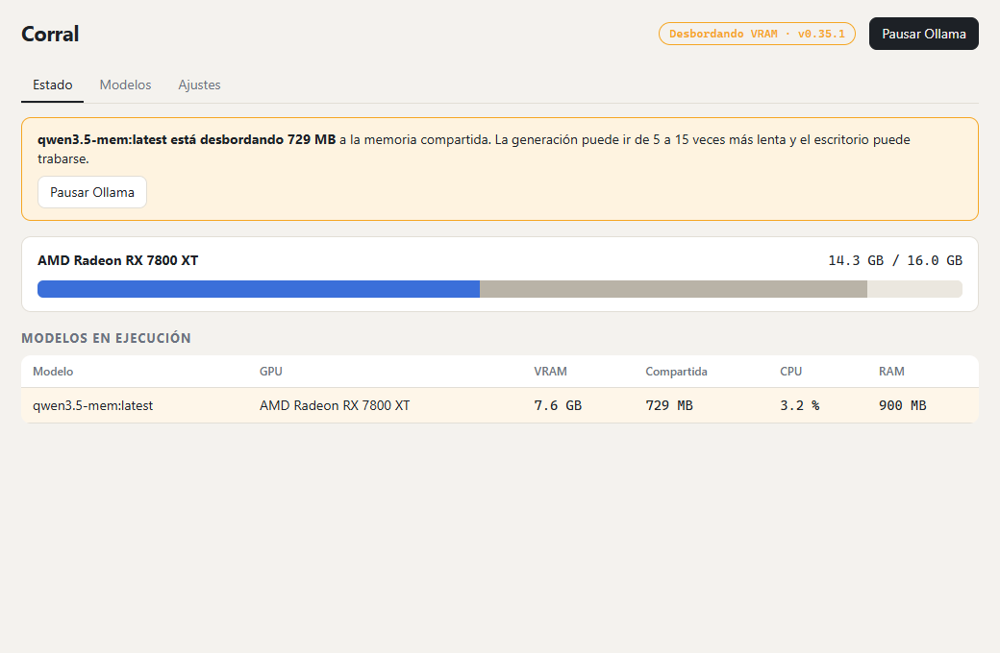

# Corral

Un corral para tus llamas: app de bandeja para Windows que muestra qué hace Ollama con tu GPU y te deja controlarlo.



## Por qué

Ollama corre en segundo plano y nadie ve cuánta VRAM ocupa. Cuando la VRAM se llena, el modelo **desborda** a la memoria compartida: la generación cae de 60-170 tok/s a 7-11 tok/s y el escritorio se traba, sin ningún aviso. Los monitores existentes miden la GPU solo con `nvidia-smi`; en AMD e Intel no ven nada.

## Qué hace

- **VRAM por GPU y por modelo, en cualquier fabricante** (AMD, NVIDIA, Intel) con los contadores de Windows (DXGI + PDH).
- **Detecta el desborde** a memoria compartida y te dice qué modelo lo causa.
- **Ícono de bandeja con estado**: verde corriendo, amarillo desbordando, gris en pausa, rojo caído.
- **Pausa y reanuda Ollama** liberando la VRAM al instante; al reanudar avisa a tus clientes (viene configurado para [claude-mem](https://github.com/thedotmack/claude-mem), que conserva su cola durante la pausa).
- **Gestiona modelos**: descargar con progreso, borrar, copiar y sacar de memoria.

## Instalar

Descarga el instalador de la [última release](https://github.com/santiquiroz/corral/releases/latest) (`.msi` o `-setup.exe`).

## Compilar

Requisitos: Rust estable, Node 24, Visual Studio Build Tools con el toolset de C++ y WebView2.

```powershell
npm install
. .\scripts\msvc-env.ps1   # carga un toolset MSVC completo
npm run tauri dev          # desarrollo
npm run tauri build        # instaladores en src-tauri/target/release/bundle
```

Pruebas: `npm test`, `npm run e2e`, `cd src-tauri; cargo test`.

Nota: los E2E muestran un aviso `[TAURI] Couldn't find callback id` que viene de un bug conocido del mock de `@tauri-apps/api` con React.StrictMode; no afecta a la app.

## Hoja de ruta

- v0.2: clientes conectados a Ollama, pausa automática al abrir juegos o apps pesadas, variantes con contexto acotado, `/metrics` para Prometheus y CLI.
- v0.3: Linux (amdgpu y NVIDIA).

## Licencia

[AGPL-3.0](LICENSE). "Ollama" es una marca de sus dueños; Corral no está afiliado a Ollama.
